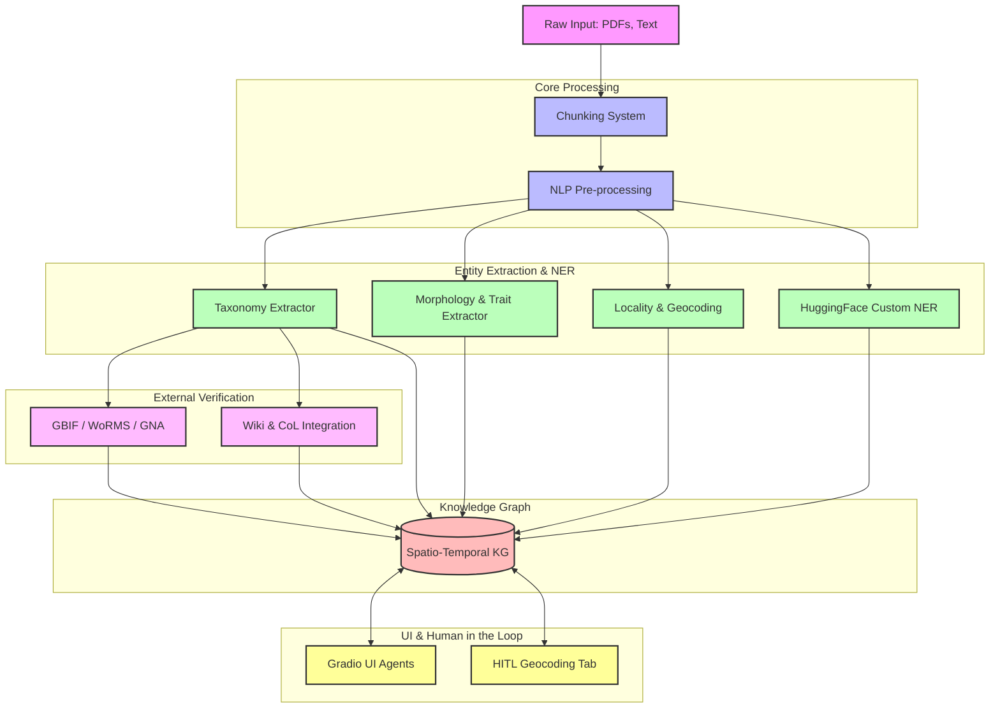

# System Architecture

The BioTrace system is composed of several specialized components that work together to ingest text/PDF data, perform structured chunking, extract entities using AI, build relationships, and verify taxonomy against global databases.

## High-Level Architecture

The diagram below illustrates the high-level architecture of BioTrace.

## Core Components

### 1. Chunking System
The entry point of the pipeline. It handles text documents and breaks them down using hierarchical and scientific chunking logic (`biotrace_chunker.py`, `biotrace_scientific_chunker.py`, `biotrace_hierarchical_chunker.py`) to preserve context, especially for tables and dense scientific literature.

### 2. Entity Extraction
Once chunked, the text passes through several Named Entity Recognition (NER) passes. This includes custom Hugging Face models (`biotrace_hf_ner.py`), specialized taxonomic extraction (`taxo_extractor.py`), morphological analysis (`biotrace_morpho_extractor.py`), and locality identification (`biotrace_locality_ner.py`).

### 3. Verification & APIs
Extracted species and taxonomy names are notoriously noisy. They are passed to the verification modules (`biotrace_unified_verifier.py`, `species_verifier.py`) which integrate with real-world databases like GBIF, GNA, and WoRMS to confirm or correct taxonomic nomenclature.

### 4. Knowledge Graph
All verified entities, relationships, traits, and geospatial data are ingested into the Knowledge Graph (`biotrace_knowledge_graph.py`, `biotrace_kg_spatio_temporal.py`). This acts as the central source of truth for the system, allowing queries across time and space for species observations.

### 5. UI & Interactive Tools
BioTrace includes Human-in-the-loop (HITL) tools, providing a user interface for scientists or users to interact with the parsed data, correct geocoding mistakes, and approve data before it hits final storage.
