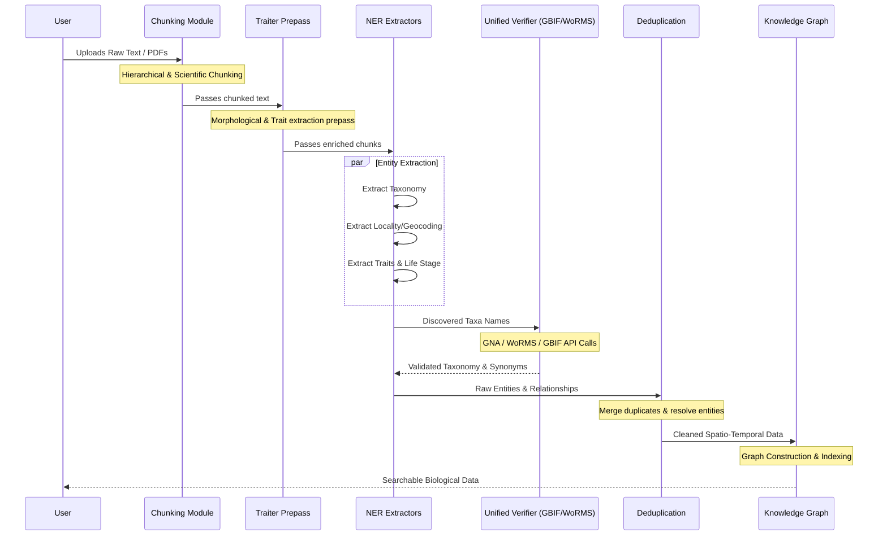

# Data Pipelines

BioTrace provides a robust set of data pipelines designed to process raw scientific literature, extract meaningful biological entities, and load them into a unified knowledge graph.

The pipelines operate in distinct stages, ensuring data is cleaned, validated, and linked accurately.

## Pipeline Flow

The following diagram illustrates the primary data flow through the BioTrace pipeline, focusing on the sequence of execution and data transformations.

## Stages in Detail

### 1. Ingestion and Chunking
**Relevant Modules:** `biotrace_chunker.py`, `biotrace_scientific_chunker.py`, `biotrace_hierarchical_chunker.py`
Raw text and documents are ingested and broken down. The system utilizes specific regex rules and heuristics to identify scientific headers, tables, and sections, preventing the separation of context-dependent information.

### 2. Pre-processing
**Relevant Modules:** `biotrace_traiter_prepass.py`
A pre-pass is executed to handle standard trait extraction. This is particularly useful for identifying measurements, morphological descriptors, and specific terminologies before deep ML-based NER is applied.

### 3. Entity Extraction (NER)
**Relevant Modules:** `biotrace_hf_ner.py`, `taxo_extractor.py`, `biotrace_locality_ner.py`, `biotrace_morpho_extractor.py`
This stage extracts the core entities:
- **Taxa:** Species, genus, and family names.
- **Localities:** Geographic coordinates, region names, and habitat descriptions.
- **Traits/Morphology:** Physical characteristics, life stages, and dimensions.

### 4. Verification and External Integration
**Relevant Modules:** `biotrace_unified_verifier.py`, `species_verifier.py`, `biotrace_gbif_verifier.py`
Extracted taxonomy is often misspelled or uses outdated synonyms in historical literature. This pipeline step asynchronously queries global databases (GBIF, GNA, WoRMS, CoL) to validate the taxa, correct spellings, and fetch current accepted nomenclature.

### 5. Deduplication and Post-processing
**Relevant Modules:** `biotrace_dedup_patch.py`, `biotrace_postprocessing.py`
Before committing to the graph, entities are unified. If the same species is mentioned multiple times with the same traits in the same context, they are deduplicated. Relationships (e.g., "Species X was found in Location Y") are solidified here.

### 6. Knowledge Graph Construction
**Relevant Modules:** `biotrace_knowledge_graph.py`, `biotrace_kg_spatio_temporal.py`
The final, clean, and verified data structures are loaded into the Spatio-Temporal Knowledge Graph. This allows for complex querying, such as "Find all species observed in the Mediterranean during the larval stage."
